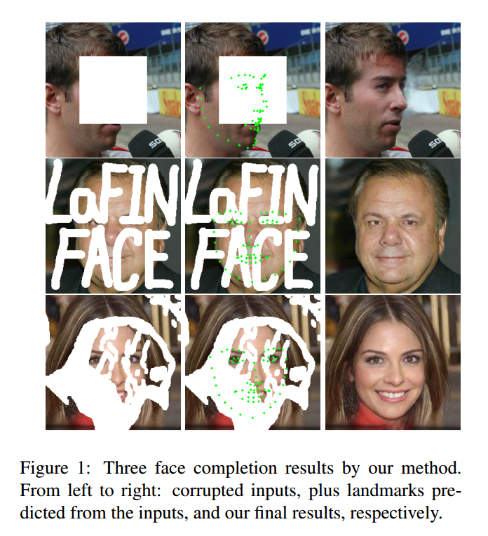

LaFIn: Generative Landmark Guided Face Inpainting
=================================
This is the PyTorch implementation of paper 'LaFIn: Generative Landmark Guided Face Inpainting', which is accepted by PRCV2020 as Best Student Paper Runner-up. [arXiv](https://arxiv.org/abs/1911.11394), [PRCV](https://link.springer.com/chapter/10.1007/978-3-030-60633-6_2)

Introduction
---------------------------------
This paper studies an effective deep learning based strategy to inpaint face images in the wild, which comprises of a facial landmark predicting subnet and an image inpainting subnet. Concretely, given partial observation, the landmark predictor aims to provide the structural information (e.g. topological relationship and expression) of incomplete faces, while the inpaintor is to generate plausible appearance (e.g. gender and ethnicity) conditioned on the predicted landmarks. In
addition, we validated that high-quality completed faces together with their landmarks can be utilized as augmented data to further improve the performance of (any) landmark predictor.



Prerequisites
---------------------------------
* Python 3.7
* Pytorch 1.0
* NVIDIA GPU + CUDA cuDNN

Installation
---------------------------------
* Clone this repo:
```
git clone https://github.com/YaN9-Y/lafin
cd lafin-master
```
* Install Pytorch
* Install python requirements:
```
pip install -r requirements.txt
```

Datasets
---------------------------------
Our repo has two parts, 1)Image Inpainting Part and 2)Augmented Landmark Detection Part. If you only want to test Image Inpainting Part, you're safe to ignore the contents about Augmented Landmark Dectection Part.
### 1.Image Inpaint Part
#### 1) Images: 
We use [CelebA](http://mmlab.ie.cuhk.edu.hk/projects/CelebA.html) and [CelebA-HQ](https://github.com/tkarras/progressive_growing_of_gans) datasets for inpaint. 

After downloading, you should split the whole dataset to train, test and validation set and run `scripts/flist.py` to genrate corresponding file lists. For example, to generate the training set file list on the CelebA dataset, you should run:
```
mkdir datasets
python3 ./scripts/flist.py --path path_to_celebA_train_set --output ./datasets/celeba_train_images.flist
```

For CelebA-HQ dataset, we use its 256x256 version. For CelebA dataset, the original image will be center cropped then resized to 256x256 during training.

#### 2) Landmarks:
For CelebA and CelebA-HQ datasets, the landmarks given by the original dataset are not enough (only 5). So we apply [FAN](https://github.com/1adrianb/face-alignment) to generate landmarks as ground truth landmarks.

You can run `scripts/preprocess_landmark.py` to generate landmarks of the images, then use `scripts/flist.py` to generate landmarks file list. For example, to generate the landmarks of the CelebA training images, you should run:
```
python3 ./scripts/preprocess_landmark.py --path path_to_CelebA_train_set --output path_to_the_celebA_landmark_train_set
python3 ./scripts/flist.py --path path_to_celebA_landmark_train_set --output ./datasets/celeba_train_landmarks.flist
```
This may take a while.

#### 3) Irregular Masks:
Our model is trained on a combination of random block masks and irregular masks. The irregular masks dataset provided by [Liu et al.](https://arxiv.org/abs/1804.07723) is available on [their website](http://masc.cs.gmu.edu/wiki/partialconv)

Then use `scripts/flist.py` to generate train/test/validataion masks file lists as above.

### 2.Augmented Landmark Detection Part
To validate the landmark detection augmented by inpainted images, please firstly download [WFLW](https://wywu.github.io/projects/LAB/WFLW.html) dataset provided by Wu et al.. 

After downloading, run `scripts/preprocess_wflw.py` to generate train/test/validation images and landmarks then run `scripts/flist.py` to generate train/test file lists.
```
python3 ./scripts/preprocess_wflw.py --path  path_to_the_WFLW_images_folder --output path_to_the_output_folder --annotation_path path_to_the_WFLW_annotations_folder
python3 ./scripts/flist.py --path path_to_the_wflw_train/test_images/landmarks_folder --output ./datasets/wflw_train/test_images/landmarks.flist 
```

Getting Started
--------------------------
To use the pre-trained models, download them from the following links then copy them to corresponding checkpoints folder, like `./checkkpoints/celeba` or `./checkpoints/celeba-hq`.

[CelebA](https://drive.google.com/open?id=1lGFEbxbtZwpPA9JXF-bhv12Tdi9Zt08G) | [CelebA-HQ](https://drive.google.com/open?id=1Xwljrct3k75_ModHCkwcNjJk3Fsvv-ra) | [WFLW](https://drive.google.com/open?id=1I2MzHre1U3wqTu5ZmGD36OiXPaNqlOKb)

### 0.Quick Testing
To hold a quick-testing of our inpaint model, download our pre-trained models of CelebA-HQ and put them into `checkpoints/example`, then run:
```
python3 test.py --model 3 --checkpoints ./checkpoints/example
```
and check the results in `checkpoints/example/results`.

Please notice that, as no face detector is applied at the landmark prediction stage, the landmark predictor is sensitive to the scale of face images. If you find the provided pre-trained model generalizes poorly on your own dataset, you may need to train your own model basing on your dataset.

### 1.Image Inpaint Part
#### 1) Training 
To train the model, create a `config.yml` file similar to `config.yml.example` and copy it to corresponding checkpoint folder. Following comments on `config.yml.example` to set `config.yml`.

The inpaint model is trained in two stages: 1) train the landmark prediction model, 2) train the image inpaint model. To train the model, run:

```
python train.py --model [stage] --checkpoints [path to checkpoints]
``` 

For example, to train the landmark prediction model on CelebA dataset, the checkpoints folder is `./checkpoints/celeba` folder, run:

```
python3 train.py --model 1 --checkpoints ./checkpoints/celeba
```

The number of training iterations can be changed by setting `MAX_ITERS` in `config.yml`.

#### 2) Testing
To test the model, create a `config.yml` file similar to `config.yml.example` and copy it to corresponding checkpoint folder. Following comments on `config.yml.example` to set `config.yml`.


The model can be tested in 3 stages (landmark prediction model, inpaint model(inpaint using ground-truth landmarks) and joint model(inpainting using predicted landmarks)).
The file list of test images and landmarks can be generated using `scripts/flist.py` then set in the `config.yml` file. For testing stage 3, the test landmark file list is not needed.

For example, to test the inpaint model on CelebA dataset under `./checkpoints/celeba` folder, run:
```
python3 test.py --model 2 --checkpoints ./checkpoints/celeba
```
### 2.Augmented Landmark Detection Part
#### 1) Training
We suppose you use WFLW dataset to validate the augmented landmark detection method.
To validate the augmentation methods, a landmark-guided inpaint model trained on WFLW (stage 2) is needed. You can train it by yourself following above steps or use the pre-trained models.

Create a `config.yml` file similar to `config.yml.example` and copy it to corresponding checkpoint folder. Following comments on `config.yml.example` to set `config.yml`.
Remeber set `AUGMENTATION_TRAIN = 1` to enable augmentation with inpainted images, amd `LANDMARK_POINTS = 98` in `config.yml`.
Then run:
```
python3 train.py --model 1 --checkpoints ./checkpoints/wflw
```
to start augmentated training.

#### 2) Testing
Create a `config.yml` file similar to `config.yml.example` and copy it to corresponding checkpoints folder. Following comments on `config.yml.example` to set `config.yml`.
Then run:
```
python3 test.py --model 1 --checkpoints ./checkpoints/wflw
```
to start testing the landmark detection model on WFLW. Set `MASK = 0` in `config.yml` to achieve the highest accuracy.


Citation
------------------------------------------
If you use this code in your research, please cite our paper. 

```
@inproceedings{yang2020generative,
  title={Generative Landmark Guided Face Inpainting},
  author={Yang, Yang and Guo, Xiaojie},
  booktitle={Chinese Conference on Pattern Recognition and Computer Vision (PRCV)},
  pages={14--26},
  year={2020},
  organization={Springer}
}

@article{yang2019lafin,
  title={Lafin: Generative landmark guided face inpainting},
  author={Yang, Yang and Guo, Xiaojie and Ma, Jiayi and Ma, Lin and Ling, Haibin},
  journal={arXiv preprint arXiv:1911.11394},
  year={2019}
}
```
